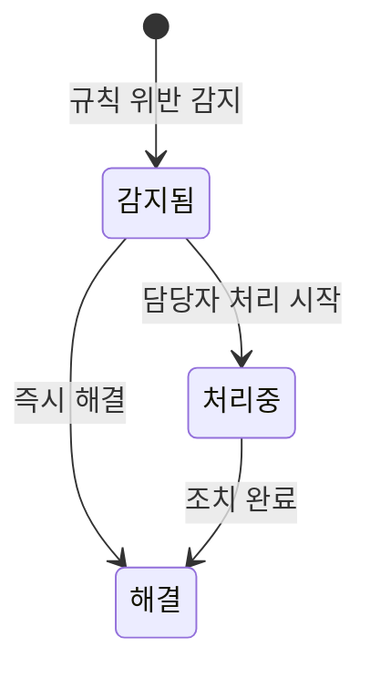
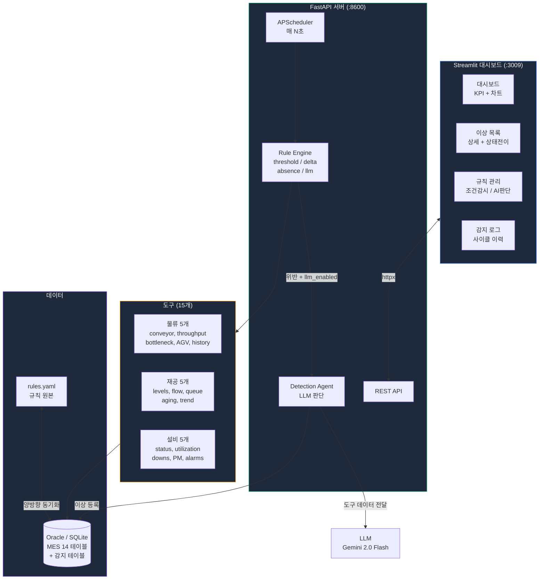
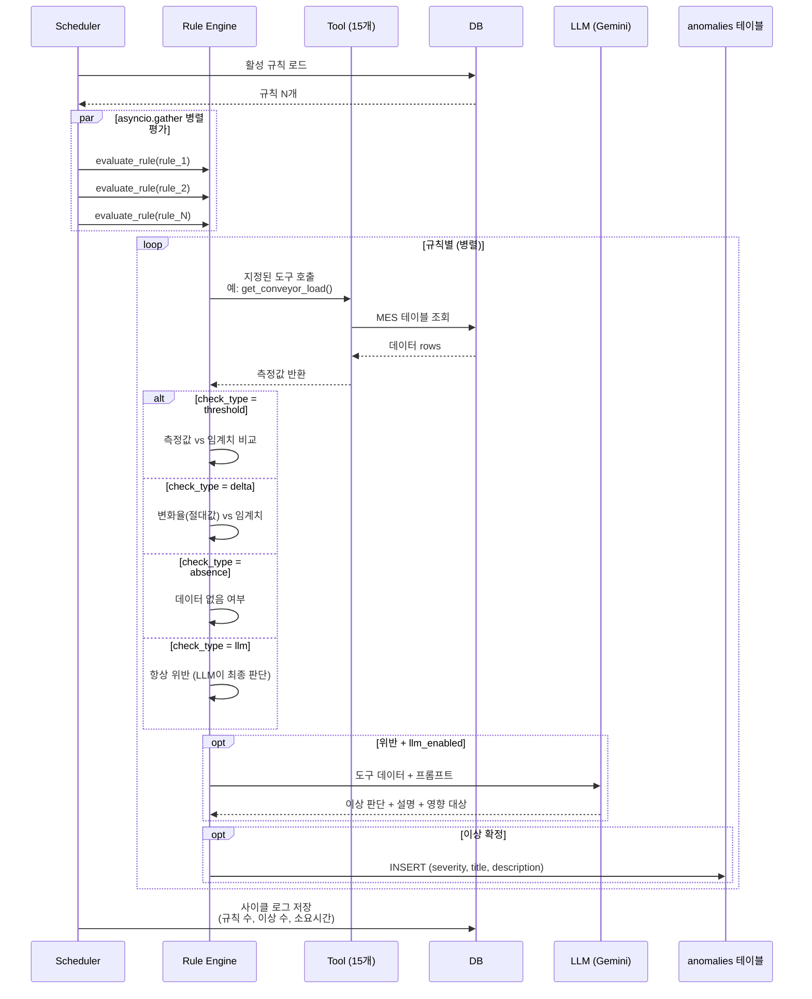
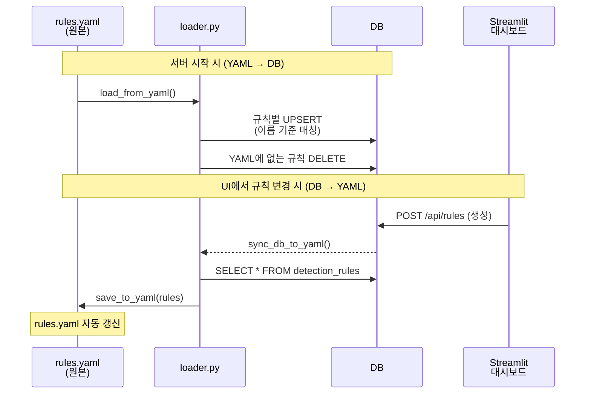
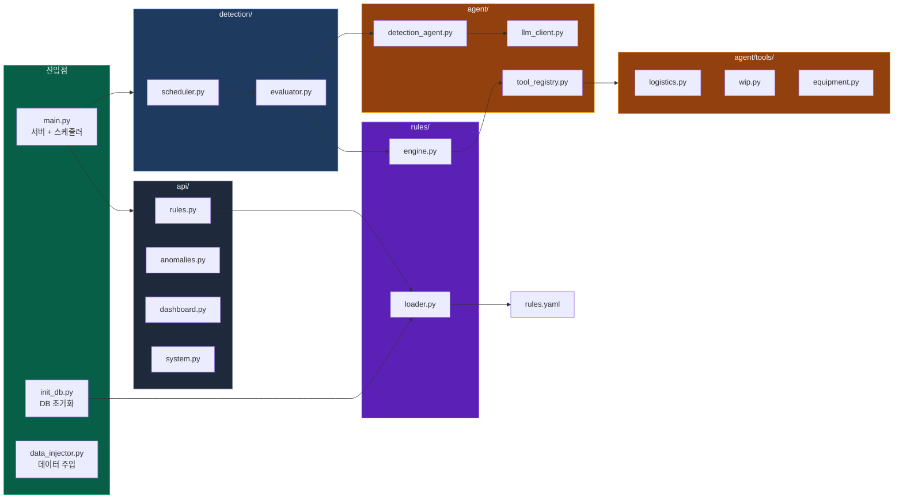
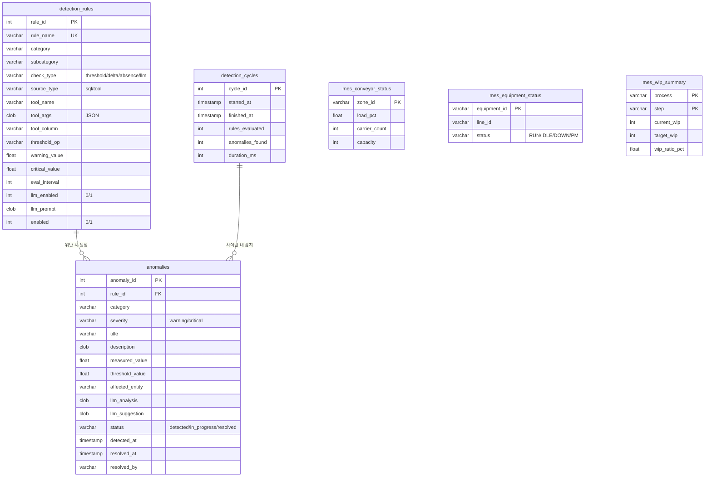
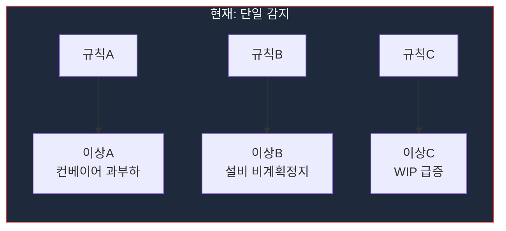
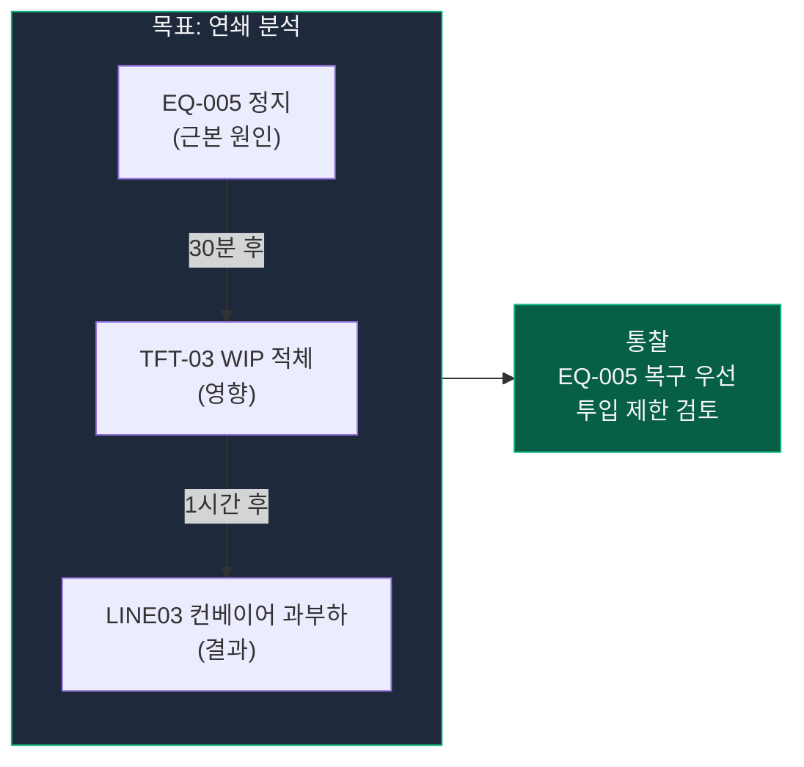

# FAB 이상감지 시스템

반도체 FAB 폐쇄망 환경에서 **물류 / 재공(WIP) / 설비** 이상을 AI 에이전트가 주기적으로 감지하여 대시보드로 제공하는 시스템.

오픈소스 프레임워크(LangChain 등) 없이, **OpenAI 호환 LLM + Oracle DB + 도구 기반 에이전트**로 구축했습니다.

> Oracle 없이 **SQLite + 더미 데이터**로 즉시 실행 가능합니다.

---

## 빠른 시작

```bash
# 1. 환경 준비
python -m venv .venv && source .venv/bin/activate
pip install -r requirements.txt

# 2. DB 초기화 (테이블 + 정상 데이터 + 규칙 동기화)
python init_db.py

# 3. API 서버 시작
python main.py --sqlite simulator.db --port 8600 --interval 60

# 4. 대시보드 (별도 터미널)
streamlit run streamlit_app/app.py

# 5. 이상 데이터 주입 (별도 터미널)
python data_injector.py --speed 2
```

| 스크립트 | 역할 | 실행 |
|----------|------|------|
| `init_db.py` | DB 생성 + 테이블 + 시딩 + 규칙 | 1회 |
| `main.py --sqlite` | API 서버 + 감지 스케줄러 | 상시 |
| `data_injector.py` | 이상 시나리오 주입 | 필요 시 |
| `streamlit run ...` | 대시보드 | 상시 |

---

## 핵심 기능

### 1. 규칙 기반 이상감지 (주기적)

등록된 규칙을 주기적으로 평가하여 이상을 감지합니다.

```
매 N초 (스케줄러)
  │
  ├─ 1. 활성 규칙 로드 (DB ← rules.yaml 동기화)
  │
  ├─ 2. 규칙별 도구 실행 + 평가 (asyncio.gather 병렬)
  │     ├─ threshold : 측정값 > 임계치?     (예: 컨베이어 부하율 > 90%)
  │     ├─ delta     : 변화율 > 임계치?     (예: WIP 1시간 변화율 > 30%)
  │     ├─ absence   : 데이터 없음?         (예: 30분간 반송 기록 없음)
  │     └─ llm       : AI에게 판단 위임     (예: 설비 복합 이상 패턴)
  │
  └─ 3. 위반 시 (llm_enabled)
        → 지정된 도구 데이터 → LLM 1회 판단
        → 실제 이상 여부 확인 → DB INSERT
```

### 2. LLM 판단 (llm_enabled 규칙)

임계치 위반이 감지되면, **LLM이 해당 도구의 데이터를 보고 실제 이상인지 판단**합니다.

```
[컨베이어 부하율 > 95% 위반]
  → get_conveyor_load() 데이터 전달
  → LLM 판단: "LINE03-ZONE-A 부하율 100%, 병목 발생 확인"
  → 이상 등록 (severity: critical)
```

- 규칙에 **도구가 1개 지정**되어 있고, 그 데이터만 LLM에 전달
- LLM은 데이터를 보고 이상 여부 + 설명 + 영향 대상을 판단
- `llm_enabled: false`인 규칙은 임계치만으로 자동 판정 (LLM 호출 없음)

### 3. YAML 기반 규칙 관리

`rules.yaml`이 규칙의 **원본(Source of Truth)**입니다.

```yaml
rules:
  - name: 컨베이어 부하율 과부하
    category: logistics
    check_type: threshold
    source_type: tool
    tool: get_conveyor_load
    tool_column: load_pct
    threshold_op: ">"
    warning_value: 85
    critical_value: 95
    llm_enabled: true
    llm_prompt: "컨베이어 부하율이 높습니다. 해당 존의 반송 이력과 병목 여부를 확인하세요."
```

- 서버 시작 시: `rules.yaml` → DB 자동 동기화
- UI에서 규칙 추가/수정/삭제 → DB 변경 → `rules.yaml` 자동 갱신

---

## 도구 (Tools) — 15개

규칙 평가 및 AI 에이전트가 사용하는 데이터 조회 도구입니다.

### 물류 (logistics) — 5개

| 도구 | 설명 | 주요 컬럼 |
|------|------|-----------|
| `get_conveyor_load` | 존별 컨베이어 부하율(%) | load_pct, carrier_count |
| `get_transfer_throughput` | 라인별 반송 처리량 | moves_1h, avg_time_sec |
| `get_bottleneck_zones` | 대기시간 초과 병목 존 | avg_wait, max_wait |
| `get_agv_utilization` | AGV/OHT 상태별 대수 및 비율 | pct, count |
| `get_zone_transfer_history` | 존별 최근 반송 이력 | — |

### 재공 (wip) — 5개

| 도구 | 설명 | 주요 컬럼 |
|------|------|-----------|
| `get_wip_levels` | 공정별 WIP 목표 대비 비율 | wip_ratio_pct, current_wip |
| `get_flow_balance` | 공정별 유입/유출 밸런스 | net_wip, inflow, outflow |
| `get_queue_length` | 스텝별 대기 LOT 수 | queue_count, avg_wait_min |
| `get_aging_lots` | 기준시간 초과 장기 체류 LOT | hours_in_step, _count |
| `get_wip_trend` | 시간별 WIP 변화 트렌드 | total_wip |

### 설비 (equipment) — 5개

| 도구 | 설명 | 주요 컬럼 |
|------|------|-----------|
| `get_equipment_status` | 설비 현재 상태 (RUN/IDLE/DOWN/PM) | _count |
| `get_equipment_utilization` | 설비 가동률(%) | utilization_pct, down_minutes |
| `get_unscheduled_downs` | 비계획정지 이력 | down_min, _count |
| `get_pm_schedule` | 예방보전(PM) 일정 및 지연 | _count |
| `get_equipment_alarms` | 설비 알람 이력 | _count |

---

## 규칙 생성 — 2가지 방식

Streamlit 대시보드에서 규칙을 추가할 때 2가지 패턴을 선택할 수 있습니다.

### 패턴 1: 조건 감시

도구를 연결하고, **감시 유형 + 감시 컬럼 + 경고/위험 임계치**를 설정합니다.

```
규칙명: "컨베이어 부하율 과부하"
  → 도구: get_conveyor_load (컨베이어 부하율)
  → 감시 유형: 임계치 초과
  → 감시 컬럼: load_pct (부하율 %)
  → 조건: > 85 (경고) / > 95 (위험)
```

감시 유형:
| 유형 | 동작 | 예시 |
|------|------|------|
| **임계치 초과** | 측정값이 임계치를 넘으면 이상 | 부하율 > 90% |
| **변화율 초과** | 측정값의 절대 변화율이 임계치를 넘으면 이상 | WIP 변화율 > 30% |
| **데이터 부재** | 도구 실행 결과 데이터가 없으면 이상 | 30분간 반송 기록 0건 |

### 패턴 2: AI 판단

도구를 연결하고, **자연어로 이상 조건을 설명**하면 AI가 매 사이클마다 판단합니다.
숫자 비교는 조건 감시에 맡기고, **패턴 인식·맥락 판단**처럼 코드로 표현하기 어려운 조건에 적합합니다.

```
규칙명: "설비 상태 복합 이상"
  → 도구: get_equipment_status (설비 현재 상태)
  → 이상 조건: "같은 라인에서 2대 이상 동시 DOWN이면 이상.
               PM 상태는 정상이니 제외해. DOWN인데 알람이 없으면 더 위험해."
```

---

## 이상 상태 흐름



| 상태 | 설명 |
|------|------|
| **감지됨** | AI가 이상을 감지하여 등록한 상태 |
| **처리중** | 담당자가 확인하고 조치 중인 상태 |
| **해결** | 조치 완료 |

---

## 아키텍처

### 시스템 구성도



### 감지 사이클 시퀀스



### 규칙 YAML ↔ DB 동기화



### 컴포넌트 구조



### ER 다이어그램 (DB 테이블)



---

## 기술 스택

| 영역 | 기술 | 설명 |
|------|------|------|
| **언어** | Python 3.12+ | 비동기(asyncio) 기반 |
| **API 서버** | FastAPI + Uvicorn | 비동기 Web API (포트 8600) |
| **대시보드** | Streamlit | 4페이지 대시보드 (포트 3009) |
| **DB (운영)** | Oracle (oracledb thin) | Instant Client 없이 순수 Python 연결 |
| **DB (개발)** | SQLite | Oracle SQL → SQLite 자동 변환 |
| **LLM** | OpenAI 호환 API | Gemini 2.0 Flash / 사내 LLM / Ollama |
| **스케줄러** | APScheduler | 감지 주기 스케줄링 |
| **AI 패턴** | Tool + LLM 판단 | 도구 데이터 → LLM 1회 판단 |
| **차트** | Plotly | 대시보드 시각화 |

---

## 프로젝트 구조

```
fab-sentinel/
├── init_db.py                      # DB 초기화 (1회 실행)
├── main.py                         # API 서버 + 감지 스케줄러
├── data_injector.py                # 이상 데이터 주입기
├── config.py                       # 환경설정 (DB, LLM, 스케줄)
├── rules.yaml                      # 규칙 원본 (Source of Truth)
├── requirements.txt
│
├── agent/                          # AI 에이전트
│   ├── llm_client.py               # OpenAI 호환 LLM 클라이언트
│   ├── tool_registry.py            # @registry.tool → JSON Schema 자동 생성
│   ├── agent_loop.py               # 에이전트 루프 (도구 데이터 → LLM 판단)
│   ├── prompts.py                  # 시스템 프롬프트
│   ├── detection_agent.py          # 도구 데이터 → LLM 판단 → DB INSERT
│   └── tools/                      # 데이터 조회 도구 (15개)
│       ├── logistics.py            # 컨베이어, 반송, 병목존, AGV
│       ├── wip.py                  # WIP, 흐름, 큐, 에이징, 트렌드
│       └── equipment.py            # 설비, 가동률, 정지, PM, 알람
│
├── rules/                          # 규칙 시스템
│   ├── models.py                   # Pydantic 모델
│   ├── engine.py                   # 규칙 평가 (threshold/delta/absence/llm)
│   └── loader.py                   # YAML ↔ DB 양방향 동기화
│
├── detection/                      # 감지 오케스트레이션
│   ├── scheduler.py                # 감지 사이클 (asyncio.gather 병렬)
│   └── evaluator.py                # 규칙별 평가 → 에이전트 연동
│
├── db/
│   ├── oracle.py                   # Oracle 비동기 커넥션 풀
│   ├── schema.sql                  # DDL
│   └── queries.py                  # 공통 쿼리
│
├── api/                            # REST API
│   ├── rules.py                    # 규칙 CRUD + 도구 카탈로그
│   ├── anomalies.py                # 이상 목록 + 상태 변경
│   ├── dashboard.py                # 대시보드 데이터
│   └── system.py                   # 헬스체크, 수동 트리거
│
├── streamlit_app/                  # Streamlit 대시보드
│   ├── .streamlit/config.toml      # 다크 테마 + 포트 3009
│   ├── api_client.py               # httpx 동기 API 래퍼
│   └── app.py                      # 4페이지 대시보드
│
└── simulator/                      # SQLite 지원 모듈
    ├── sqlite_backend.py           # Oracle → SQLite 몽키패치
    ├── sql_compat.py               # Oracle SQL → SQLite 자동 변환
    ├── mes_schema.sql              # MES 테이블 스키마 (14개)
    ├── seeder.py                   # 정상 상태 더미 데이터 생성
    └── scenarios.py                # 이상 시나리오 (5개)
```

---

## 설치 및 실행

### 요구사항

- Python 3.12+
- (운영) Oracle DB + MES 테이블
- (개발) 별도 DB 불필요 (SQLite)

### 개발 모드 (SQLite)

Oracle 없이 SQLite로 전체 시스템을 실행합니다.

```bash
# 가상환경 생성 + 패키지 설치
python -m venv .venv && source .venv/bin/activate
pip install -r requirements.txt
```

#### Step 1. DB 초기화

```bash
python init_db.py
```

- MES 14개 테이블 + 감지 3개 테이블 생성
- 설비, 컨베이어, AGV, WIP, LOT 등 정상 상태 더미 데이터 시딩
- `rules.yaml` → SQLite 규칙 동기화

옵션:
| 옵션 | 기본값 | 설명 |
|------|--------|------|
| `--db` | `simulator.db` | SQLite 파일 경로 |
| `--reset` | — | 기존 DB 삭제 후 재생성 |

```bash
# 커스텀 DB 파일
python init_db.py --db my_test.db

# 기존 DB 초기화
python init_db.py --reset
```

#### Step 2. API 서버 시작

```bash
python main.py --sqlite simulator.db
```

- `--sqlite` 플래그로 SQLite 모드 자동 전환 (Oracle monkey-patch)
- 감지 스케줄러 자동 시작 (기본 300초 간격)

옵션:
| 옵션 | 기본값 | 설명 |
|------|--------|------|
| `--sqlite` | — | SQLite DB 파일 (없으면 Oracle 모드) |
| `--port` | `8600` | API 포트 |
| `--interval` | `300` | 감지 주기 (초) |

```bash
# 60초 간격, 포트 9000
python main.py --sqlite simulator.db --port 9000 --interval 60
```

#### Step 3. 대시보드

```bash
streamlit run streamlit_app/app.py
```

브라우저에서 `http://localhost:3009` 접속.

#### Step 4. 이상 데이터 주입

정상 데이터만으로는 이상이 감지되지 않습니다.
별도 터미널에서 이상 시나리오를 주입합니다.

```bash
python data_injector.py
```

5개 시나리오가 60초 간격으로 주입됩니다:

| 순서 | 시나리오 | 주입 내용 |
|------|---------|----------|
| 1 | 컨베이어 과부하 | LINE03-ZONE-A 부하율 96%로 변경 |
| 2 | 설비 비계획정지 | EQ-005 DOWN + CRITICAL 알람 |
| 3 | WIP 적체 | TFT-03 공정 WIP 170%로 급등 |
| 4 | 에이징 LOT | 5개 LOT 24~48시간 체류 |
| 5 | AGV 장애 | AGV 3대 ERROR 상태 |

옵션:
| 옵션 | 기본값 | 설명 |
|------|--------|------|
| `--db` | `simulator.db` | SQLite DB 파일 |
| `--speed` | `2` | 속도 배율 (2 = 30초 간격) |
| `--reset` | — | 이전 주입 데이터 초기화 후 재주입 |
| `--loop` | — | 주입 후 상황 점진적 악화 반복 |

```bash
# 빠르게 테스트 (100x 속도)
python data_injector.py --speed 100

# 이전 데이터 지우고 다시 주입
python data_injector.py --reset

# 주입 후 계속 악화 (Ctrl+C로 중지)
python data_injector.py --reset --loop
```

### 운영 모드 (Oracle)

```bash
# 환경변수 설정
export ORACLE_USER=fab
export ORACLE_PASSWORD=password
export ORACLE_DSN=dbhost:1521/FABDB
export LLM_BASE_URL=http://llm-server:8080/v1
export LLM_API_KEY=your-key
export LLM_MODEL=model-name

# 실행 (--sqlite 없으면 Oracle 모드)
python main.py
streamlit run streamlit_app/app.py
```

---

## API 엔드포인트

| 영역 | 엔드포인트 | 설명 |
|------|-----------|------|
| 규칙 | `GET /api/rules` | 규칙 목록 |
| 규칙 | `POST /api/rules` | 규칙 생성 |
| 규칙 | `PATCH /api/rules/{id}` | 규칙 수정 |
| 규칙 | `DELETE /api/rules/{id}` | 규칙 삭제 |
| 규칙 | `POST /api/rules/{id}/test` | 도구 테스트 실행 |
| 규칙 | `GET /api/rules/tools/catalog` | 도구 카탈로그 (15개) |
| 이상 | `GET /api/anomalies` | 이상 목록 |
| 이상 | `GET /api/anomalies/active` | 활성 이상 |
| 이상 | `PATCH /api/anomalies/{id}/status` | 상태 변경 |
| 대시보드 | `GET /api/dashboard/overview` | 현황 요약 |
| 대시보드 | `GET /api/dashboard/timeline` | 타임라인 |
| 대시보드 | `GET /api/dashboard/heatmap` | 히트맵 |
| 시스템 | `GET /health` | 헬스체크 |
| 시스템 | `POST /api/detect/trigger` | 수동 감지 실행 |
| 시스템 | `GET /api/stats` | 통계 |

---

## DB 테이블

### 감지 테이블

| 테이블 | 용도 |
|--------|------|
| `detection_rules` | 감지 규칙 (도구 + 임계치 + LLM 프롬프트) |
| `anomalies` | 감지된 이상 + AI 분석 결과 |
| `detection_cycles` | 감지 사이클 로그 (소요시간, 규칙 수, 이상 수) |

### MES 테이블 (14개)

| 영역 | 테이블 | 용도 |
|------|--------|------|
| 물류 | `mes_conveyor_status` | 존별 컨베이어 현재 부하 |
| 물류 | `mes_transfer_log` | 반송 이력 (출발→도착, 소요시간) |
| 물류 | `mes_carrier_queue` | 대기 중인 캐리어 큐 |
| 물류 | `mes_vehicle_status` | AGV/OHT 상태 (RUN/IDLE/ERROR) |
| 재공 | `mes_wip_summary` | 공정·스텝별 현재 WIP vs 목표 |
| 재공 | `mes_wip_flow` | WIP 유입/유출 흐름 |
| 재공 | `mes_queue_status` | 스텝별 대기 LOT 수 + 대기시간 |
| 재공 | `mes_lot_status` | LOT별 현재 위치 + 체류시간 |
| 재공 | `mes_wip_snapshot` | 시간별 WIP 스냅샷 (트렌드) |
| 설비 | `mes_equipment_status` | 설비 현재 상태 |
| 설비 | `mes_equipment_history` | 설비 상태 이력 |
| 설비 | `mes_down_history` | 비계획정지 이력 |
| 설비 | `mes_pm_schedule` | PM 일정 |
| 설비 | `mes_equipment_alarms` | 설비 알람 이력 |

---

## Streamlit 대시보드

### 4개 페이지

| 페이지 | 기능 |
|--------|------|
| **대시보드** | KPI 카드 (활성위험/경고/24h이상/활성규칙), 상태 분포 차트, 수동 감지 |
| **이상 목록** | 상태별 필터 (감지됨/처리중/해결), 좌우 분할(목록+상세), AI 분석, 상태 전이 |
| **규칙 관리** | 2탭 추가 (조건 감시/AI 판단), 감시 유형 선택, 도구 카탈로그, 테스트 실행 |
| **감지 로그** | 감지 사이클 이력, 상태별 이상 통계 |

### Oracle ↔ SQLite 전환

`main.py`의 `--sqlite` 플래그 유무로 전환합니다.

```
python main.py                          # Oracle 모드 (운영)
python main.py --sqlite simulator.db    # SQLite 모드 (개발)
```

내부적으로 `simulator/sqlite_backend.py`가 `db.oracle` 모듈의 함수(`execute`, `execute_dml` 등)를 SQLite 버전으로 교체(monkey-patch)합니다. 나머지 코드(도구, 쿼리, 에이전트)는 **동일한 코드**가 양쪽 모드에서 실행됩니다.

Oracle SQL → SQLite 변환(`simulator/sql_compat.py`)이 자동 처리하는 항목:
- `SYSTIMESTAMP` → `datetime('now')`
- `FETCH NEXT N ROWS ONLY` → `LIMIT N`
- `NVL()` → `COALESCE()`
- `INTERVAL '24' HOUR` → `datetime('now', '-24 hours')`
- 바인드 변수 `:name` → `:name` (동일)

---

## 추후 확장

| 기능 | 설명 | 참고 파일 |
|------|------|----------|
| **연쇄 이상감지** | 여러 규칙의 이상을 종합 분석하여 연쇄 영향·근본 원인 도출 (아래 상세) | — |
| **RCA (근본원인분석)** | DB 폴링으로 이상 자동 분석 | `agent/rca_agent.py` |
| **알림** | DB 기록 → 이메일/메신저 연동 | `alert/router.py` |
| **에스컬레이션** | 미확인 이상 자동 재알림 | `alert/escalation.py` |
| **상관분석** | 시간/공간/인과 기반 이상 그룹핑 | `correlation/engine.py` |

### 연쇄 이상감지 (Cross-Rule Insight)

현재는 규칙 1개 = 도구 1개로 **단일 이상**만 감지합니다.
하지만 실제 FAB에서는 여러 이상이 동시에 발생하며 서로 연결되어 있습니다.





**구현 방향:**
- 감지 사이클 내 다건 이상 발생 시 → LLM에 전체 이상 목록 + 각 도구 데이터 전달
- 시간/공간/인과 관계 분석 → 연쇄 그룹 생성
- 단일 이상 설명이 아닌 **상황 전체에 대한 통찰** 제공
